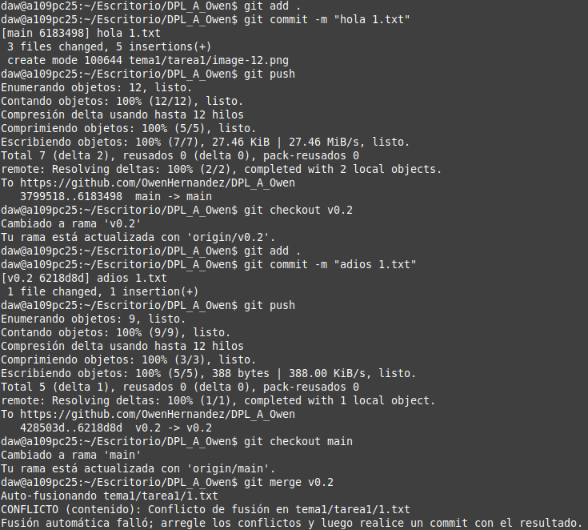
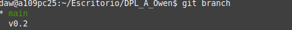
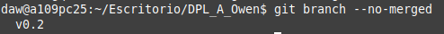
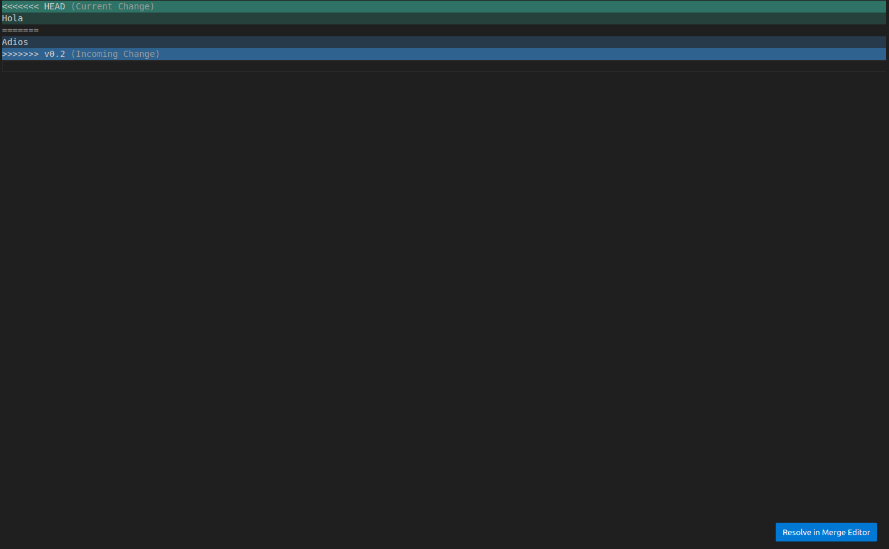
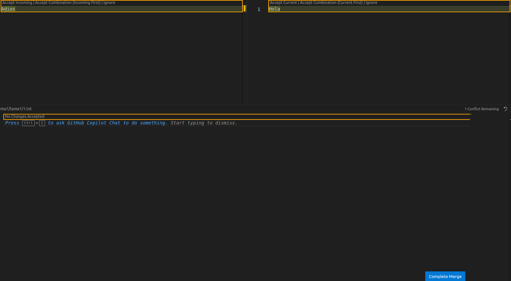
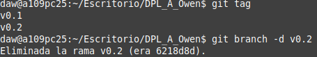
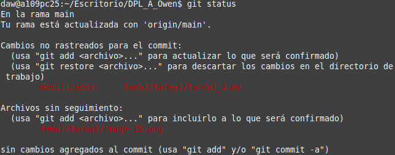
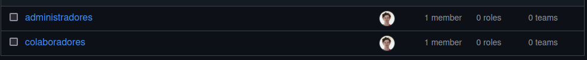
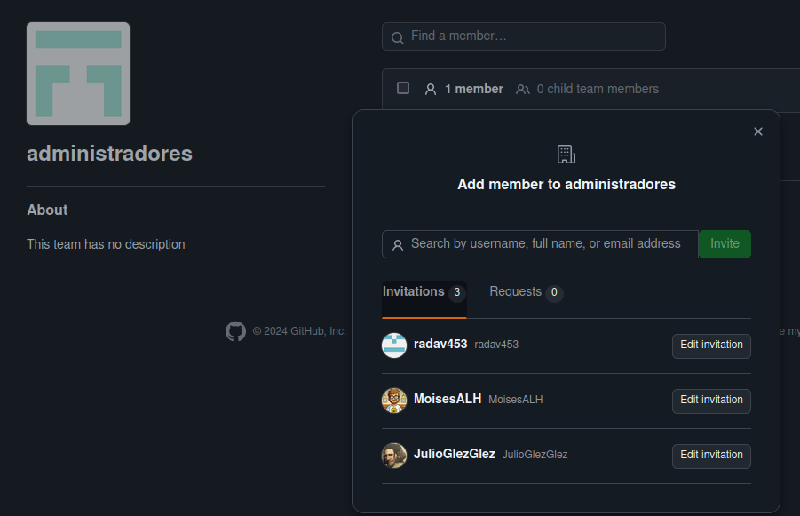
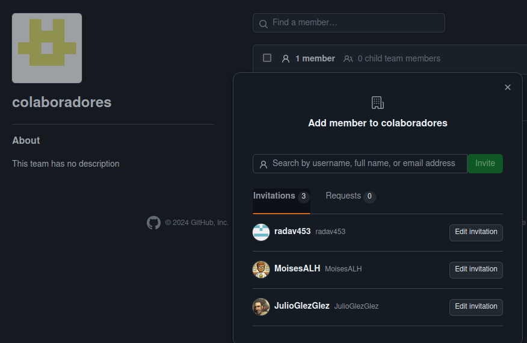

### Crear una rama

### Añadir fichero

### Subir la rama remota

### Merge de v0.2

### Merge con conflictos

### Ramas con y sin merge

### Arraglar conflictos

Yo lo hice en el Visual Studio Code ya que es mucho más sencillo

Primero: fui al fichero que daba problemas y pulse el boton de abajo a la derecha

Segundo: elegir el cambio más acertado, pulsar el doble tick que aparece encima del cambio correspondiente y cuando hayas acabado pulsar el boton de "Complete Merge" que aparece abajo a la derecha

### Borrar Rama

### Listar Cambios

### Crear Organización

### Crear Equipos

