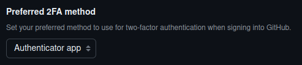

### Clonar el repositorio en local
```bash
git clone
```
### Commit y Push


### Ignorar ficheros y/o Carpetas


### Añadir un fichero


### Crear un tag


### Configuracion y Uso Social de Github

Foto de Perfil


Autenticación de doble factor



Seguir Repositorios


Poner estrellas


Crear una Tabla

| Nombre | Github |
|--------|--------|
| Angel  | https://github.com/Angel-L-G |
| Moíses | https://github.com/MoisesALH |
| Julio  | https://github.com/JulioGlezGlez |

### Colaboradores

